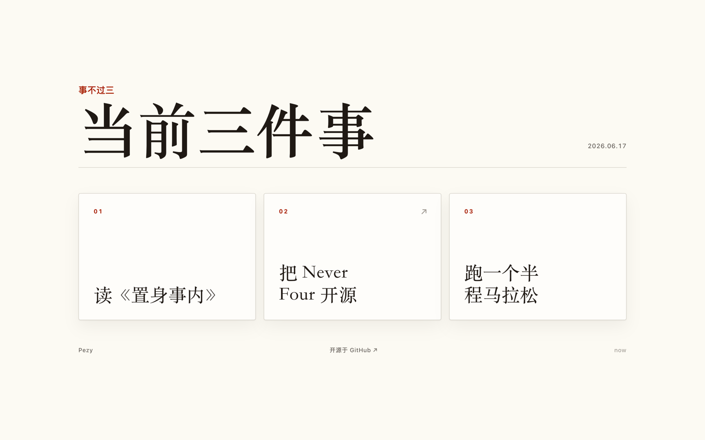

<div align="center">

# 事不过三 · Never Four

<p><em>③ 一个自托管的极简页面，只展示「当前最多三件事」。</em></p>

<p>
  <a href="https://github.com/pezy/NeverFour/stargazers"></a>
  <a href="https://github.com/pezy/NeverFour/blob/main/LICENSE"></a>
  <a href="https://developers.cloudflare.com/workers/"></a>
  <a href="https://never-four.urbancpz.workers.dev"></a>
</p>



</div>

## 为什么

「事不过三」是一种克制：同一时间，只把最多三件事放到台前。

它不是待办清单，不会自动重置，也不留历史 —— 想换，就整组换掉。页面对所有人公开只读，改动只能由你带着一个全局 token 发一次 POST。

## 特性

- 🗂 一组 **0–3 项**，超过 3 项直接拒绝（不截断）
- 🔓 页面公开只读，写入仅凭一个全局 `WRITE_TOKEN`
- 🔗 每项可带链接；`/now`、`/papers`、`/books` …… 每个 key 都是一张独立公开页
- ⚡ 单文件 Worker + D1，服务端渲染，零 JS、零追踪、边缘冷启动
- 🧪 一条 `npm test` 覆盖：鉴权 / 超 3 项拒绝 / 整组幂等替换

## 快速开始

需要 Node.js 18+。命令都走 `npx wrangler`，无需全局安装。本地一分钟看到页面：

```bash
cp .dev.vars.example .dev.vars   # 把里面的 WRITE_TOKEN 改成任意本地 token
npm run db:migrate:local         # 建本地 D1 表
npm run dev                      # 打开 http://localhost:8787
npm test                         # 跑最小测试
```

## 部署

需要一个开通了 Workers 和 D1 的 Cloudflare 账号：

```bash
npx wrangler login
npx wrangler d1 create never-four     # 把输出的 database_id 填进 wrangler.toml 的 [[d1_databases]]
npm run db:migrate:remote             # 给线上 D1 建表
npx wrangler secret put WRITE_TOKEN   # 设置全局写入 token
npm run deploy                        # 输出里就是你的 workers.dev 地址
```

部署后访问 `https://never-four.<你的子域>.workers.dev` 即可公开查看。Fork 自部署时，把 `wrangler.toml` 里的 `OWNER_NAME` 和 `REPO_URL` 改成你自己的。

> 若 `wrangler secret put` 提示找不到 Worker 名，确认你在项目根目录、且 `wrangler.toml` 里 `name = "never-four"`。临时绕过：`npx wrangler secret put WRITE_TOKEN --name never-four`。

## 更新内容（curl）

用 `WRITE_TOKEN` 整组替换某个 key（下例是 `now`）。`items` 给 0–3 项，每项有 `text`、可选 `url`；给 4 项返回 `400`。

```bash
export NEVER_FOUR_URL="https://never-four.<你的子域>.workers.dev"
export WRITE_TOKEN="你的-token"

curl -X POST "$NEVER_FOUR_URL/api/sets/now" \
  -H "authorization: Bearer $WRITE_TOKEN" \
  -H "content-type: application/json" \
  --data '{
    "title": "当前三件事",
    "items": [
      { "text": "写产品页面" },
      { "text": "读一篇论文", "url": "https://example.com" }
    ]
  }'
```

成功返回更新后的组 JSON 与公开地址 `public_url`。把 `now` 换成别的 key，就是另一组的独立公开页。

## iOS 快捷指令

用「获取 URL 内容」动作即可一键更新：

| 字段 | 值 |
| --- | --- |
| 方法 | `POST` |
| URL | `https://never-four.<你的子域>.workers.dev/api/sets/now` |
| 请求头 | `authorization: Bearer <你的 WRITE_TOKEN>`<br>`content-type: application/json` |
| 请求体 | 选「JSON」，结构如下 |

```json
{
  "title": "当前三件事",
  "items": [
    { "text": "写产品页面" },
    { "text": "读一篇论文", "url": "https://example.com" }
  ]
}
```

运行后刷新公开页即可看到新内容。

## 自动部署

`.github/workflows/deploy.yml` 在每次 PR 与推送到 `main` 时跑 `npm test`；推送到 `main` 且配置了密钥时，自动迁移线上 D1 并 `wrangler deploy`。

启用方式：在仓库 **Settings → Secrets and variables → Actions** 添加 `CLOUDFLARE_API_TOKEN`（权限需含 *Workers Scripts: Edit* 与 *D1: Edit*）。未配置该密钥时，部署步骤会被自动跳过，CI 仍为绿。

## 许可

[MIT](LICENSE) © Pezy
